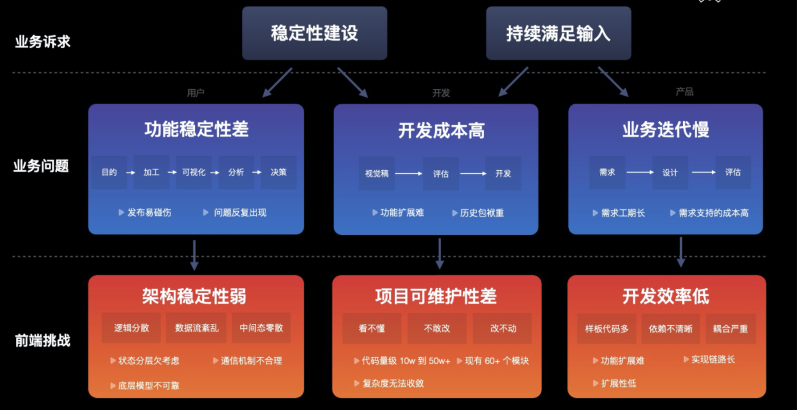
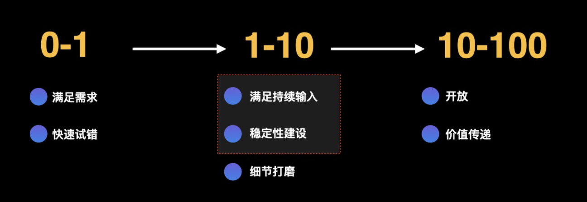

>### 生活
- 
>### 工作
- 思考大型应用问题和挑战
	1. [参考](https://juejin.cn/post/6906013981958209550)
	1. 何为“大型应用”
		- 强专业性（功能与使用需要一定专业领域的知识）
		- 复杂度高（View：多组件组合、State：伴随很多的琐碎的中间状态、Control：完整的功能需要多个模块协同完成）
		- 代码量级高（持续迭代开发）
	1. 问题和挑战
		- 
	1. 一个产品一般情况下会经历 3 个阶段	
		- 
>### 业余	
- 医保是什么、怎么报销
杭州社保规则（https://www.zhihu.com/question/24316379/answer/1234312885）